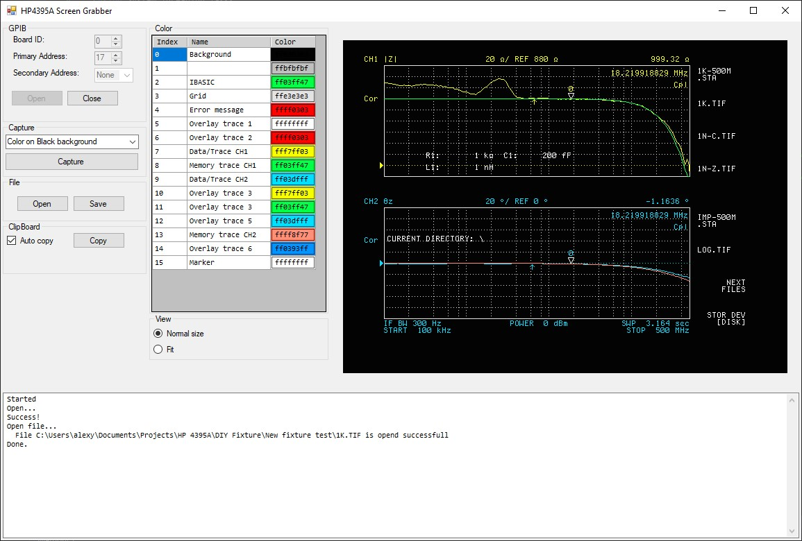

# HP4395A Screen Grabber

Grabs screenshot from a HP4395A Network/Spectrum/Impedance Analyzer through  GPIB interface and the NI-488 drivers.

## Install

The binaries are here: [HP4395A Screen Grabber binaries](https://github.com/Lexy1972/HP4395A_Screen_Grabber/releases/tag/1.0). Just download the HP4395A_Screen_Grabber_EXE.zip and unpack. Keep the exe and dll's together in a folder.

Then download the National Instruments drivers from here: [NI-488](https://www.ni.com/nl-nl/support/downloads/drivers/download.ni-488-2.html#442610). Install them with the default settings.

After the drivers are installed, start the main executable HP4395A_Screen_Grabber.exe.

## What can it do?

Well, it makes a screenshot of the connected instrument by simply pressing the "Capture" button. The image is downloaded from the instrument via GPIB bus and than shown in the UI (See screenshot above). After download, the image is put on the Clipboard, so you can past it easily into your documentation. There is also an option to save the image as TIG,JPG,BMP or PNG.

With the combobox above the Capture button you can set the color mode of the image:

- Color on White background
- Color on Black background
- Black and White

But you can also change the color's of some items with the Color table. Just click on the color cell of the item you want to change and a color chooser will popup.
Note that these color categories of the items are dictated by the instrument and I just have given them a name. This is not something that can be changes. 

## How does it work?

The code is loosly based on this codeproject project: [Instrument Snapshot: How to Acquire and Render Screen-shots from Older Test Equipment](https://www.codeproject.com/Articles/872469/Instrument-Snapshot-How-to-Acquire-and-Render-Scre) 
I first tried this project, but I clouldn't get it to work. So i decided to make my own tool.

The screen grabbing works by sending the commands to save a Graphic to the memory disk and than read it back into the programm and show it.

