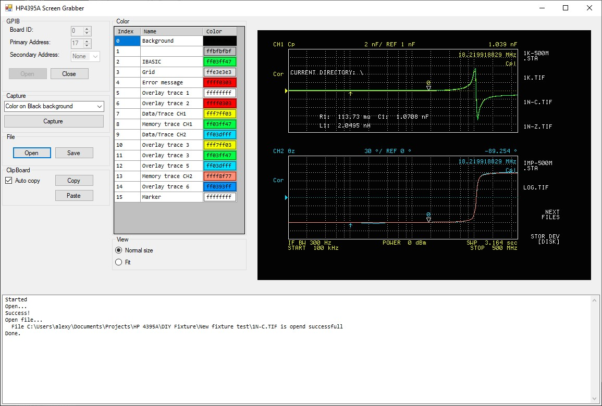

# HP4395A Screen Grabber

Grabs screenshot from a HP4395A Network/Spectrum/Impedance Analyzer trhough GPIB interface and the NI-488 drivers.

##Install

The binaries are here: [HP4395A Screen Grabber binaries](https://github.com/Lexy1972/HP4395A_Screen_Grabber/releases/tag/1.0). Just download the HP4395A_Screen_Grabber_EXE.zip and unpack. Keep the exe and dll's together in a folder.

Then download the National Instruments drivers from here: [NI-488](https://www.ni.com/nl-nl/support/downloads/drivers/download.ni-488-2.html#442610). Install them with the default settings.

After the drivers are installed, start the main executable HP4395A_Screen_Grabber.exe.

